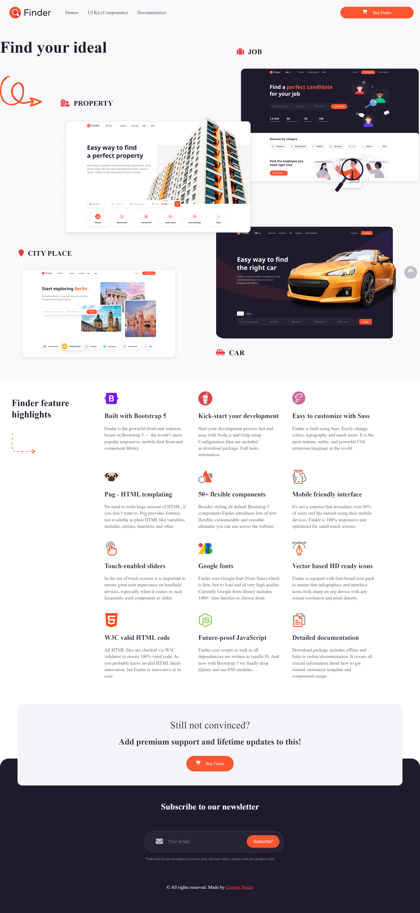

# Finder-Directory

;
;

## Welcome! 👋

Obrigado por conferir este desafio de codificação de front-end.

# Índice
- Desafio
- Links
- Tecnologias usadas
- O que eu aprendi
- Recursos úteis
- Desafio
- layout ideal para a seção, dependendo do tamanho da tela do dispositivo

## Links usados
- https://www.youtube.com/watch?v=x-4z_u8LcGc
- https://developer.mozilla.org/en-US/docs/Learn/CSS.

## Tecnologias usandas:
- Marcação HTML5 semântica
- Flexbox
- js
- CSS

## O que eu aprendi
- Melhorando as habilidades no CSS
- Marcadores semânticos importantes - - para HTML
- Praticando flexbox para melhorar o - - design da página

## Autor
- @mjpfelicia
